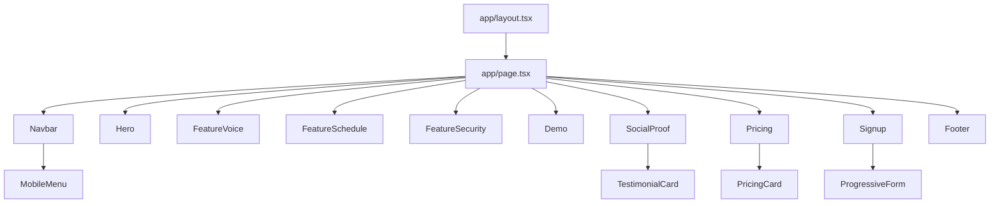

# Documento de Design

## Visão Geral

Este design descreve a componentização de uma landing page HTML monolítica do Evolua em um projeto Next.js 14+ (App Router) com TypeScript e Tailwind CSS. A abordagem prioriza componentes React funcionais, tipados, responsivos e fiéis ao design original.

A arquitetura segue o padrão de composição do Next.js App Router: uma página raiz (`page.tsx`) compõe componentes de seção, que por sua vez podem usar subcomponentes compartilhados.

## Arquitetura



### Estrutura de Diretórios

```
src/
├── app/
│   ├── layout.tsx          # Layout raiz com fonte DM Sans e metadata
│   ├── page.tsx            # Página principal compondo todas as seções
│   └── globals.css         # Estilos globais (glass-card, animações, scrollbar)
├── components/
│   ├── Navbar.tsx           # Navegação fixa com menu mobile
│   ├── Hero.tsx             # Seção hero com headline e CTA
│   ├── FeatureVoice.tsx     # Seção "Relatórios por Voz"
│   ├── FeatureSchedule.tsx  # Seção "Agenda Inteligente"
│   ├── FeatureSecurity.tsx  # Seção "Prontuário Digital" + "Sigilo Total"
│   ├── Demo.tsx             # Seção de demonstração com player mockup
│   ├── SocialProof.tsx      # Seção de depoimentos
│   ├── Pricing.tsx          # Seção de preços
│   ├── PricingCard.tsx      # Cartão individual de plano
│   ├── TestimonialCard.tsx  # Cartão individual de depoimento
│   ├── Signup.tsx           # Seção de cadastro com formulário progressivo
│   └── Footer.tsx           # Rodapé
├── hooks/
│   └── useSectionFade.ts    # Hook para animação de fade-in ao entrar na viewport
└── types/
    └── index.ts             # Tipos compartilhados (PricingPlan, Testimonial, etc.)
```

## Componentes e Interfaces

### Layout Raiz (`app/layout.tsx`)

Responsável por:
- Configurar a fonte DM Sans via `next/font/google`
- Definir metadata da página (título, descrição)
- Aplicar classes globais do Tailwind ao `<html>` e `<body>`

### Página Principal (`app/page.tsx`)

Componente servidor que compõe todas as seções na ordem correta. Não contém lógica — apenas composição.

### Navbar

```typescript
// Componente cliente ("use client") para gerenciar estado do menu mobile
interface NavLink {
  label: string;
  href: string; // âncora: #diferenciais, #demonstracao, etc.
}

// Estado interno: isMenuOpen (boolean)
// Comportamento: scroll suave via scrollIntoView, toggle do menu mobile
```

### Hero

```typescript
// Componente servidor, sem estado
// Renderiza headline, subtítulo e botão CTA com ícone de seta
// Aplica classe section-fade para animação de entrada
```

### Feature Sections (FeatureVoice, FeatureSchedule, FeatureSecurity)

```typescript
// FeatureVoice: Componente servidor
// - Glass card com conteúdo ilustrativo de relatório por voz

// FeatureSchedule: Componente servidor
// - Mockup de chat com assistente de agendamento

// FeatureSecurity: Componente servidor
// - Grid de 2 colunas (md:grid-cols-2) com Prontuário Digital e Sigilo Total
// - Empilha em mobile (grid-cols-1)
```

### Demo

```typescript
// Componente servidor
// Mockup visual de player de vídeo com botão play e barra de controles
// Sem funcionalidade de vídeo real — apenas visual
```

### SocialProof e TestimonialCard

```typescript
interface Testimonial {
  name: string;
  role: string;
  avatarUrl: string;
  quote: string;
}

// SocialProof: renderiza lista de TestimonialCard
// TestimonialCard: renderiza avatar, nome, cargo e citação
```

### Pricing e PricingCard

```typescript
interface PricingPlan {
  name: string;
  price: string;        // ex: "49"
  period: string;       // ex: "/mês"
  features: string[];
  highlighted: boolean; // plano recomendado
  ctaLabel: string;
}

// Pricing: renderiza 2 PricingCards lado a lado (empilha em mobile)
// PricingCard: renderiza cartão com nome, preço, lista de features e CTA
```

### Signup (Formulário Progressivo)

```typescript
// Componente cliente ("use client") para gerenciar estado do formulário
interface SignupFormState {
  name: string;
  email: string;
  phone: string;
  currentStep: number; // controla quais campos estão visíveis
}

// Comportamento:
// - Campo nome sempre visível
// - onChange do nome: revela campo email (step 1 → 2)
// - onChange do email: revela campo telefone (step 2 → 3)
// - Validação básica: campos obrigatórios não podem estar vazios no submit
```

### Footer

```typescript
// Componente servidor
// Renderiza logo, links (Suporte, Privacidade, Termos) e copyright
```

### Hook: useSectionFade

```typescript
// Hook customizado usando IntersectionObserver
// Adiciona classe de animação quando a seção entra na viewport
// Retorna ref para anexar ao elemento da seção

function useSectionFade(): React.RefObject<HTMLElement>;
```

## Modelos de Dados

### Tipos Compartilhados (`types/index.ts`)

```typescript
export interface NavLink {
  label: string;
  href: string;
}

export interface Testimonial {
  name: string;
  role: string;
  avatarUrl: string;
  quote: string;
}

export interface PricingPlan {
  name: string;
  price: string;
  period: string;
  features: string[];
  highlighted: boolean;
  ctaLabel: string;
}

export interface SignupFormState {
  name: string;
  email: string;
  phone: string;
  currentStep: number;
}
```

### Dados Estáticos

Os dados de conteúdo (textos, depoimentos, planos) serão definidos como constantes nos próprios componentes ou em um arquivo de dados, já que a landing page é estática. Não há necessidade de API ou banco de dados.

### Configuração Tailwind

```typescript
// tailwind.config.ts - extensão de cores
const config = {
  theme: {
    extend: {
      colors: {
        primary: '#8A05BE',
        'primary-hover': '#7A04AA',
        'primary-light': '#F3E8FF',
        // demais cores do design original
      },
      fontFamily: {
        sans: ['var(--font-dm-sans)', 'sans-serif'],
      },
    },
  },
};
```


## Propriedades de Corretude

*Uma propriedade é uma característica ou comportamento que deve ser verdadeiro em todas as execuções válidas de um sistema — essencialmente, uma declaração formal sobre o que o sistema deve fazer. Propriedades servem como ponte entre especificações legíveis por humanos e garantias de corretude verificáveis por máquina.*

### Property 1: Componentes de seção renderizam todos os elementos obrigatórios

*Para qualquer* renderização dos componentes Navbar ou Hero, todos os elementos de conteúdo especificados (logo, links, botões, headline, subtítulo) devem estar presentes no output renderizado.

**Validates: Requirements 2.1, 3.1**

### Property 2: Cartões orientados a dados renderizam todos os campos

*Para qualquer* objeto Testimonial válido (com name, role, avatarUrl e quote não-vazios) passado ao TestimonialCard, e *para qualquer* objeto PricingPlan válido (com name, price, period, features e ctaLabel não-vazios) passado ao PricingCard, o output renderizado deve conter todos os valores dos campos do objeto.

**Validates: Requirements 6.1, 7.1**

### Property 3: Plano destacado tem distinção visual

*Para qualquer* PricingPlan com `highlighted: true`, o PricingCard renderizado deve possuir classes CSS ou atributos visuais distintos em relação a um PricingCard com `highlighted: false`.

**Validates: Requirements 7.2**

### Property 4: Divulgação progressiva do formulário

*Para qualquer* string não-vazia digitada no campo de nome do formulário de cadastro, os campos da próxima etapa devem se tornar visíveis. O estado dos campos anteriores deve ser preservado.

**Validates: Requirements 8.2, 8.4**

### Property 5: Validação do formulário rejeita submissões inválidas

*Para qualquer* estado do formulário onde campos obrigatórios estejam vazios ou compostos apenas de espaços em branco, a submissão deve ser impedida e indicações visuais de erro devem ser exibidas.

**Validates: Requirements 8.3**

## Tratamento de Erros

### Formulário de Cadastro
- Campos obrigatórios vazios: exibir borda vermelha e mensagem de erro inline
- Submissão impedida até que todos os campos obrigatórios estejam preenchidos
- Estado do formulário preservado em caso de erro (não limpar campos)

### Navegação
- Links de âncora para seções inexistentes: falha silenciosa (scrollIntoView não encontra o elemento)
- Menu mobile: fechar automaticamente ao clicar em um link ou ao redimensionar para desktop

### Carregamento de Fonte
- Fallback para sans-serif caso DM Sans não carregue (configurado via next/font)

### Ícones
- Material Symbols carregados via CDN; fallback para texto caso não carregue

## Estratégia de Testes

### Abordagem Dual

A estratégia combina testes unitários e testes baseados em propriedades:

**Testes Unitários** (Jest + React Testing Library):
- Verificar renderização de cada componente com dados específicos
- Testar interações do menu mobile (abrir/fechar)
- Testar scroll suave ao clicar em links
- Testar estados responsivos em breakpoints específicos
- Testar edge cases do formulário (campos vazios, submissão)

**Testes Baseados em Propriedades** (fast-check + React Testing Library):
- Mínimo de 100 iterações por teste de propriedade
- Cada teste deve referenciar a propriedade do design
- Formato de tag: **Feature: componentize-landing-page, Property {N}: {título}**

### Mapeamento de Testes

| Propriedade | Tipo de Teste | Componente |
|---|---|---|
| Property 1 | Property-based | Navbar, Hero |
| Property 2 | Property-based | TestimonialCard, PricingCard |
| Property 3 | Property-based | PricingCard |
| Property 4 | Property-based | Signup |
| Property 5 | Property-based | Signup |

### Biblioteca de Testes Baseados em Propriedades

- **fast-check** para geração de dados aleatórios
- Integração com Jest e React Testing Library
- Cada propriedade de corretude implementada como um único teste de propriedade
- Configuração: `fc.assert(fc.property(...), { numRuns: 100 })`
